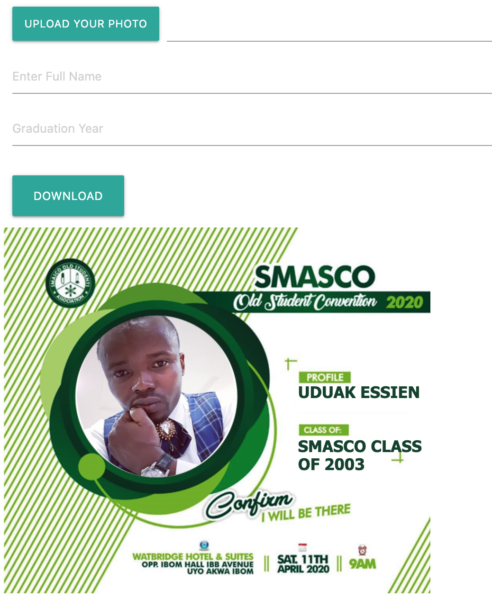

# SMASCO Alumni Convention - Profile Photo Generator

> SMASCO Alumni Convention profile photo generator, takes screen shot of an html section of the page using the html2canva js library.

## Built With

-   HTML
-   CSS
-   JAVASCRIPT

## Live Demo

[Live Demo Link](https://acushlakoncept.github.io/smasco/)

## Authors

**Uduak Essien**

-   Github: [@acushlakoncept](https://github.com/acushlakoncept/)
-   Twitter: [@acushlakoncept](https://twitter.com/acushlakoncept)
-   Linkedin: [acushlakoncept](https://www.linkedin.com/in/acushlakoncept/)

## 🤝 Contributing

Contributions, issues and feature requests are welcome!

Feel free to check the [issues page](issues/).

## Show your support

Give a ⭐️ if you like this project!

## Acknowledgments

-   Hat tip to anyone whose code was used
-   Inspiration
-   etc
